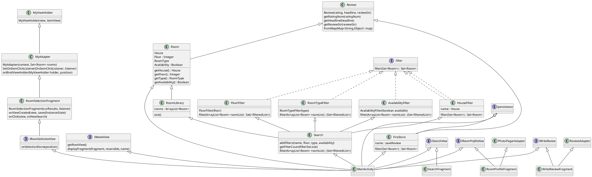
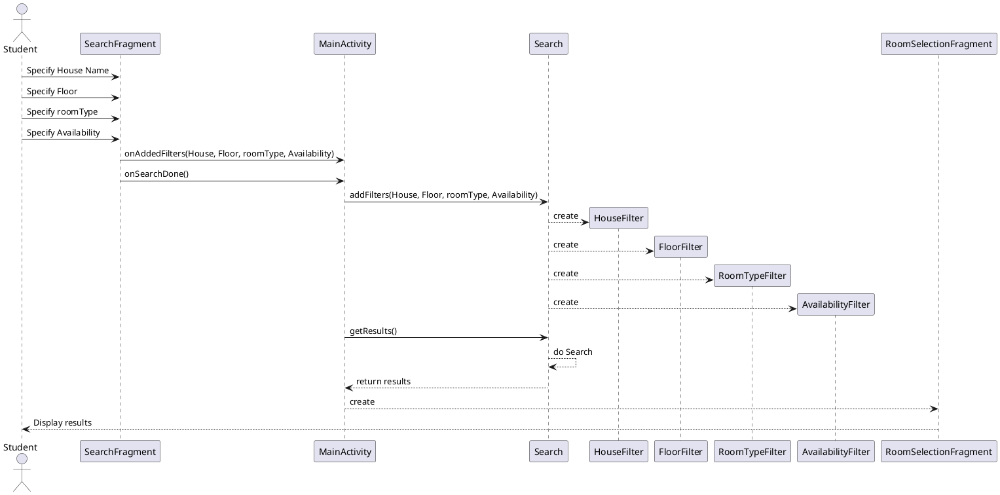
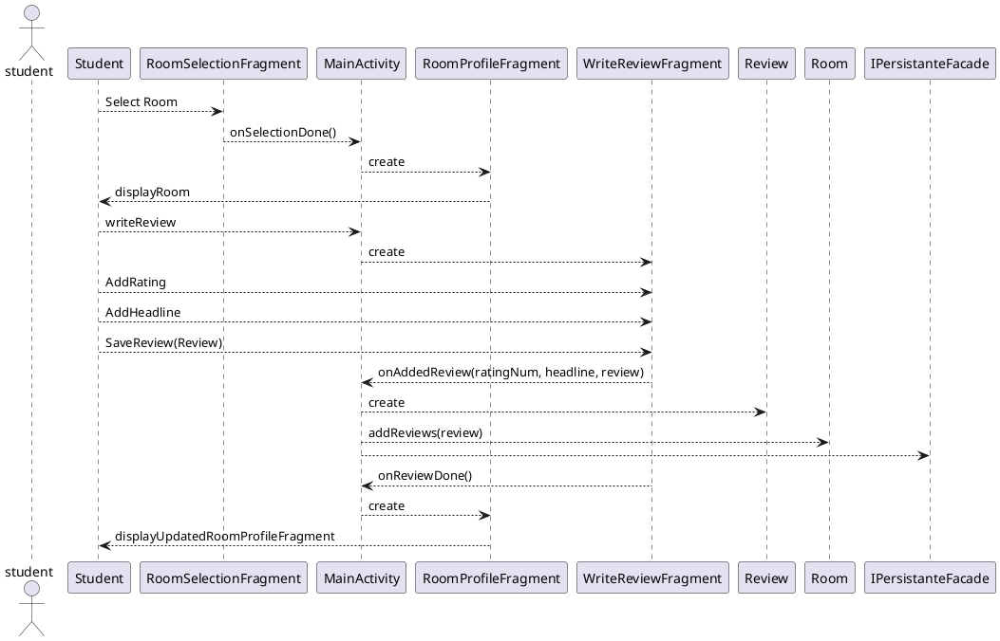

# Design

## Design Class Diagram

```plantuml
@startuml

class Room 
Review <|-- Room
Room : House
Room : Floor : Integer
Room : RoomType
Room : Availability : Boolean
Room : getHouse() : House
Room : getFloor() : Integer
Room : getType() : RoomType
Room : getAvailability() : Boolean

class FireStore 
Filter <|.. HouseFilter
FireStore : name : saveReview
FireStore : filter(Set<Room>) : Set<Room>
Review <|-- FireStore
Review : Review(rating, headline, reviewStr)
Review : getRatingNum(ratingNum)
Review : getHeadline(headline)
Review : getReviewStr(reviewStr)
Review : fromMap(Map<String,Object> map)
Ipersistance <|-- FireStore


class RoomLibrary
Room <|-- RoomLibrary
RoomLibrary : rooms : ArrayList<Room>
RoomLibrary : size()

interface Filter
Filter : filter(Set<Room>) : Set<Room>

interface Ipersistance
Ipersistance <|-- MainActivity 

interface ISearchView
ISearchView <|-- MainActivity
ISearchView <|-- SearchFragment 

interface IRoomSelectionView
IRoomSelectionView <|-- MainActivity
IRoomSelectionView : onSelectionDone(position)
RoomSelectionFragment <|-- IRoomSelectionView 
RoomSelectionFragment : RoomSelectionFragment(curResults, listener)
RoomSelectionFragment : onViewCreated(view, savedInstanceState)
RoomSelectionFragment : onClick(view, onNewSearch)
MyAdapter <|-- RoomSelectionFragment
MyAdapter : MyAdapter(context, Set<Room> rooms)
MyAdapter : SetOnItemClickListener(OnItemClickListener, listener)
MyAdapter : onBindViewHolder(MyViewHolder holder, position)

MyViewHolder <|-- MyAdapter
MyViewHolder : MyViewHolder(view, itemView)

interface IRoomProfileView
IRoomProfileView <|-- MainActivity
IRoomProfileView <|-- RoomProfileFragment
PhotoPagerAdapter <|-- RoomProfileFragment

interface IWriteReview 
IWriteReview <|-- MainActivity
IWriteReview <|-- WriteReviewFragment
ReviewAdapter <|-- WriteReviewFragment

interface IManinView
IManinView <|-- MainActivity
IManinView : getRootView()
IManinView : displayFragment(fragment, reversible, name)

class HouseFilter
Filter <|.. HouseFilter
HouseFilter : name : House
HouseFilter : filter(Set<Room>) : Set<Room>

class FloorFilter 
FloorFilter <|-- Search 
FloorFilter : FloorFilter(floor)
FloorFilter : filter(ArrayList<Room> roomList) : Set(<filteredList>)
Filter <|.. FloorFilter
RoomTypeFilter <|-- Search
RoomTypeFilter : RoomTypeFilter(type)
RoomTypeFilter : filter(ArrayList<Room> roomList) : (Set<filteredList>)
Filter <|.. RoomTypeFilter
AvailabilityFilter <|-- Search
AvailabilityFilter : AvailabilityFilter(boolean available)
AvailabilityFilter : filter(ArrayList<Room> roomList) : (Set<filteredList>)
Filter <|.. AvailabilityFilter 
HouseFilter <|-- Search

RoomLibrary <|-- Search
Search <|-- MainActivity
Search : addFilters(name, floor, type, availability)
Search : getFilterCount(filterSet.size)
Search : filter(ArrayList<Room> roomList) : (Set<filteredList>)
Room <|-- MainActivity
FireStore <|-- MainActivity

@enduml
```

```plantuml
@startuml
actor Student
Student -> SearchFragment: Specify House Name 
Student -> SearchFragment: Specify Floor
Student -> SearchFragment: Specify roomType
Student -> SearchFragment: Specify Availability
SearchFragment -> MainActivity: onAddedFilters(House, Floor, roomType, Availability)
SearchFragment -> MainActivity: onSearchDone()
MainActivity -> Search: addFilters(House, Floor, roomType, Availability) 
create HouseFilter
Search --> HouseFilter: create 
create FloorFilter 
Search --> FloorFilter: create
create RoomTypeFilter 
Search --> RoomTypeFilter :create
create AvailabilityFilter 
Search --> AvailabilityFilter: create
MainActivity -> Search: getResults() 
Search --> Search: do Search 
Search --> MainActivity: return results 
MainActivity --> RoomSelectionFragment: create
RoomSelectionFragment --> Student: Display results 


@enduml
```

```plantuml
@startuml
actor student
Student --> RoomSelectionFragment: Select Room 
RoomSelectionFragment --> MainActivity: onSelectionDone()
MainActivity --> RoomProfileFragment: create 
RoomProfileFragment --> Student: displayRoom 
Student --> MainActivity: writeReview 
MainActivity --> WriteReviewFragment: create
Student --> WriteReviewFragment: AddRating
Student --> WriteReviewFragment: AddHeadline
Student --> WriteReviewFragment: SaveReview(Review) 
WriteReviewFragment --> MainActivity: onAddedReview(ratingNum, headline, review)
MainActivity --> Review: create
MainActivity --> Room: addReviews(review)
MainActivity --> IPersistanteFacade 
WriteReviewFragment --> MainActivity: onReviewDone()
MainActivity --> RoomProfileFragment: create
RoomProfileFragment --> Student: displayUpdatedRoomProfileFragment 


@enduml
```