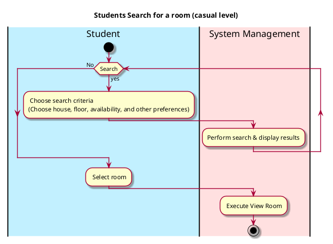

# Search for a room

## 1. Primary actor and goals
__Students__: Their goals are to search for a room that accompany them in any dorms. in any cases like how big is that or is it a single or not.

## 2. Other stakeholders and their goals
 Students are searching for a room, Specified to the house, and the floor.

## 3. Preconditions

_-Students searching for a room_:
* Students enroll to the school and identified.

## 4. Postconditions

* Room is available.
* Able to see all rooms.
* Show the recent reviewed rooms.
* show the most high viewed rooms.

## 5. Workflow

