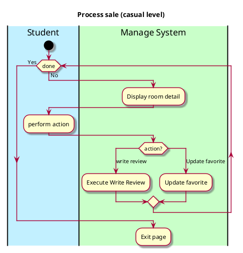

# Use case name, e.g., process sale

## 1. Primary actor and goals

__Student__: Wants to view rooms, being able to write a review, choose the favourite.

## 2. Preconditions

_Room Information_:

* Student is a Vassar student.
* Student has already done a search and has selected a room to view.

## 3. Postconditions

_Room Information_:

* Room is saved.
* Being able to see all rooms.
* Being able to write review for all rooms.
* Favourite rooms are saved or deleting the favourite rooms.

## 4. Workflow
 _Room Information_:

