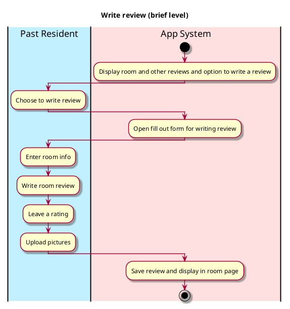

# Write Review

## 1. Primary actor and goals

__Past/Current Resident__: wants to add useful information about the room they lived in to help students know how the 
room looks like and what past residents liked (or disliked) about it. Wants easy, organized way to write review, upload 
pictures and rate room.

## 2. Other stakeholders and their goals

* __Student searching for room__: Wants useful, organized information. Wants easily visible display of reviews, photos, 
ratings, and availability. Wants verified, accurate information to base their decisions on.

## 3. Preconditions

* Past/current resident is a Vassar student and has stayed in the room they are reviewing.
* The resident has searched for and found the room they are reviewing.

## 4. Postconditions

* Review is saved.
* Review is visible/accessible to everyone.

## 5. Workflow

